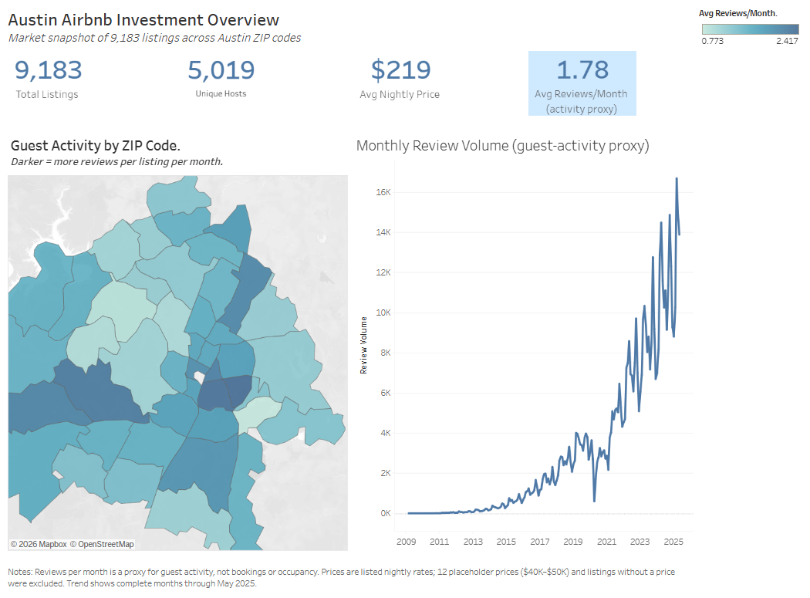
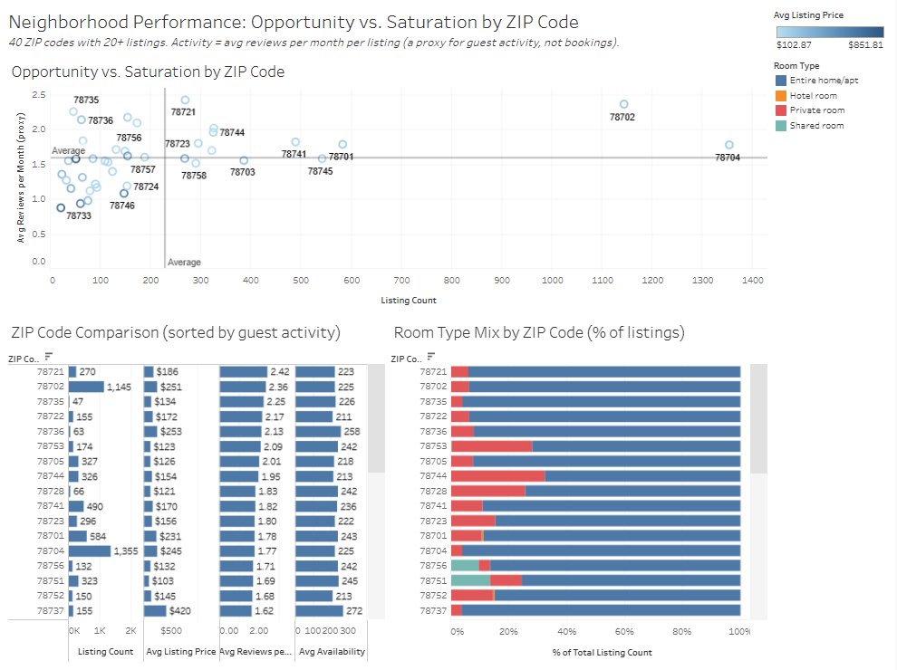
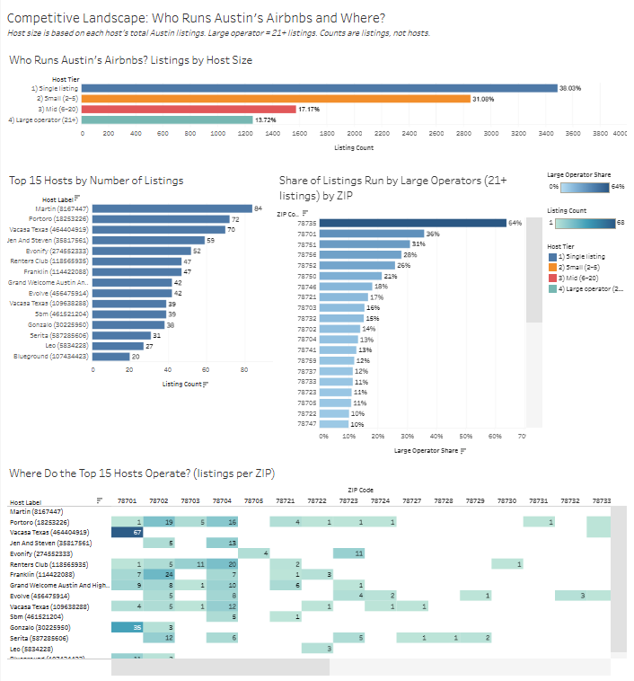
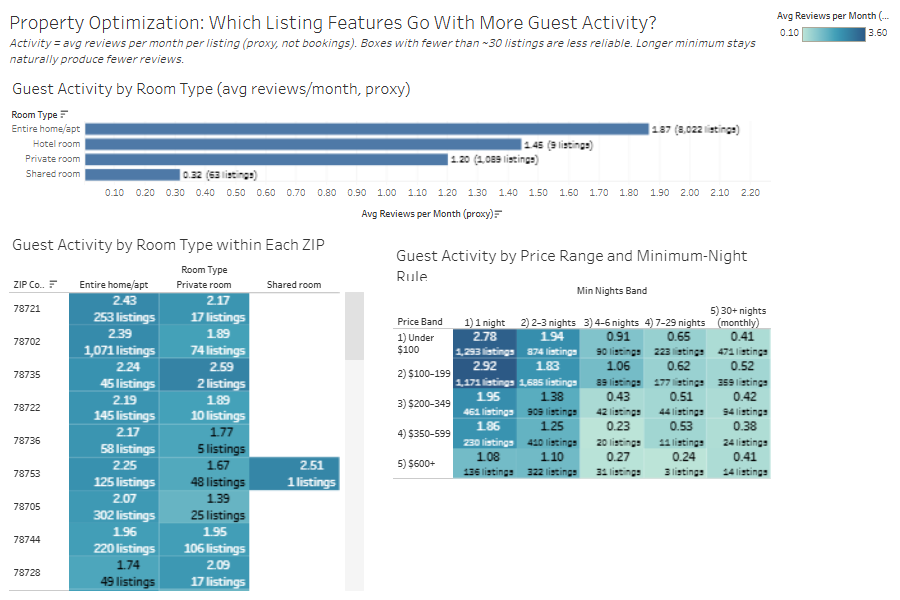

# Austin Airbnb Investment Opportunity Dashboard

**Where in Austin, and with what kind of listing, does a new short-term rental have the best data-backed chance of strong guest activity?**

A four-dashboard Tableau project that analyzes 9,183 priced Austin Airbnb listings to find ZIP codes with strong guest activity, reasonable prices and less competition, then identifies the listing features linked to the most activity.

> **Note on the main metric:** The dataset has no bookings, occupancy, revenue or profit data. Guest activity is measured with **reviews per month, used as a proxy for demand**. Every finding is labeled that way, and none of them claim earnings or ROI.

**[Read the full report (PDF)](report/Austin_Airbnb_Investment_Analysis.pdf)**

---

## Key findings

| # | Finding |
|---|---|
| 1 | **The market is large and growing.** 9,183 listings from 5,019 hosts average $219/night. Monthly reviews hit a record 16,681 in March 2025 after recovering from the 2020 COVID drop. |
| 2 | **78721 is the cleanest opportunity.** It has the highest activity of the 40 ZIPs with 20+ listings (2.42 reviews/month), a moderate $186 average price, and only 17% of listings run by large operators. |
| 3 | **78735 looks good but is misleading.** It is small and active (2.25), but 64% of its listings belong to large multi-property operators. |
| 4 | **78702 and 78704 are proven but crowded.** Each has more than 1,100 listings. |
| 5 | **Entire homes with short stays lead.** Entire homes average 1.87 reviews/month vs. 1.20 for private rooms. Listings priced $100–199 with a 1-night minimum reach 2.92, and activity drops sharply at 4+ night minimums. |

**Recommendation:** Focus research on an entire home in ZIP 78721, priced around $100–199 per night, with a 1–3 night minimum stay. Before acting, check costs, local short-term rental rules and real booking data, none of which are in this dataset.

---

## Dashboards

### 1. Investment Overview
Market size, average price, the activity proxy, a ZIP-level activity map and the monthly review trend.



### 2. Neighborhood Performance
An opportunity-vs-saturation scatter plot (activity vs. listing count), a ZIP comparison table and the room-type mix by ZIP.



### 3. Competitive Landscape
Listings by host size, the top 15 hosts, the share of each ZIP run by large operators (21+ listings), and where the top hosts are concentrated.



### 4. Property Optimization
Activity by room type, by room type within each ZIP, and a price × minimum-night heat map.



---

## Data

| Item | Detail |
|---|---|
| Rows | 670,923 review rows (one row per guest review) |
| Listings | 12,276 unique; 9,183 after removing missing and placeholder prices |
| Hosts | 5,019 |
| Time range | Reviews from 2009 to June 2025; the trend ends May 2025, the last complete month |
| Geography | Austin ZIP codes; ZIP comparisons use the 40 ZIPs with 20+ listings |

The raw data file is not included in this repo because of its size.

## Methodology

1. **Profiled the data** and confirmed the row grain (one row per review, not per listing).
2. **Cleaned prices** with a global filter ($9–$10,000, nulls excluded). This removed 12 placeholder prices of $40K–$50K and about 3,081 listings with no price.
3. **Weighted every average to the listing** with an LOD expression, so a listing with 500 reviews counts once, not 500 times.
4. **Set minimum sample sizes** (20+ listings per ZIP) so small areas don't distort comparisons.
5. **Grouped values into bands** for price, minimum nights and host size.
6. **Checked outliers** instead of deleting them blindly. For example, the top host's ~$22 average price is real: those listings are co-living rooms.

### Key calculated fields

```
Listing Count             = COUNTD([Listing Id])
Rows Per Listing          = {FIXED [Listing Id] : COUNT([Listing Id])}
Avg Listing Price         = SUM([Price] / [Rows Per Listing]) / [Listing Count]
Reviews Per Month (clean) = ZN([Reviews Per Month])
Host Tier                 = Single (1) | Small (2–5) | Mid (6–20) | Large operator (21+)
Large Operator Share      = Large Operator Listings / Listing Count
```

## Limitations

- Reviews per month is a **proxy**. Not every guest leaves a review.
- No revenue, occupancy, cost, tax, ROI, regulation or complaint data.
- Listings with zero reviews, and listings removed before the extract, are missing.
- Availability shows open calendar days, not booked days.
- Segments with fewer than about 30 listings are unreliable.

## Tools

Tableau Cloud: calculated fields, LOD expressions, table calculations, Top N and condition filters, reference lines, dashboard design.

## Author

**Victoria Reyna**, B.A. Multidisciplinary Studies (Applied Data Science), University of Texas at San Antonio
